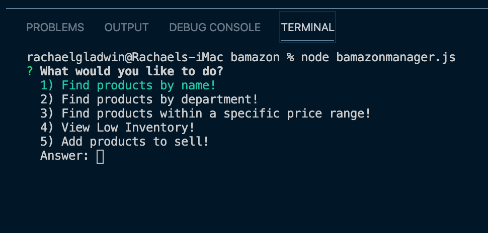

# bamazon
A command line database for your shopping pleasure, built with MySQL and Node.JS.

<h1>Do you love to shop?</h1>

<h3>Then Bamazon has something for you!</h3>

<ul>
<lead> Prerequisites:</lead>
<li> Familiarity with Command Line Interface commands</li>
<li> Understanding of NPM installs and required packages</li>
  <li> Clone this repo and open in a command line application like terminal</li>  
</ul>

<ol>
<lead> NPM Packages Used:</lead>
<li> Inquirer</li>
<li> Colors</li>
<li> mysql</li>
</ol>

<h3> The Application Should...</h3>

 When running "node bamazoncustomer.js" the user will be prompted to view the inventory or buy an item directly, from the command line the user should be able to view invetory then select an item to buy, or just to buy if selected.

 When running "node bamazonmanager.js" the user will be prompted with 5 options, after an option is selected the application will prompt them in order to complete the request.

